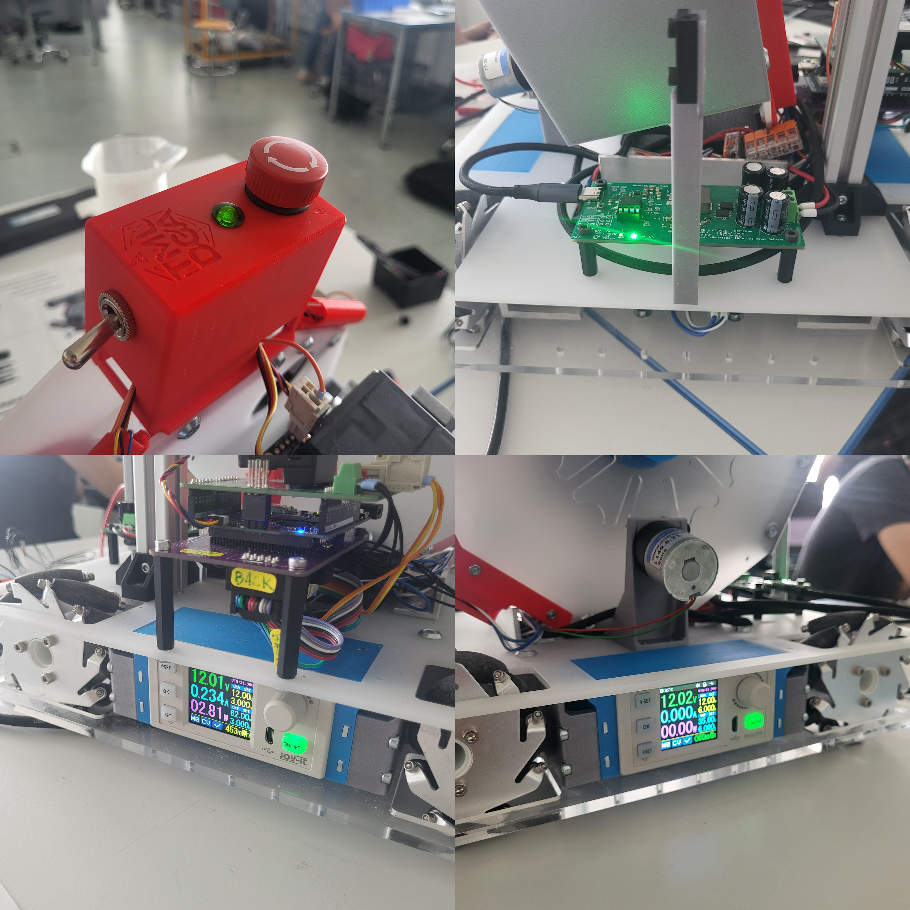
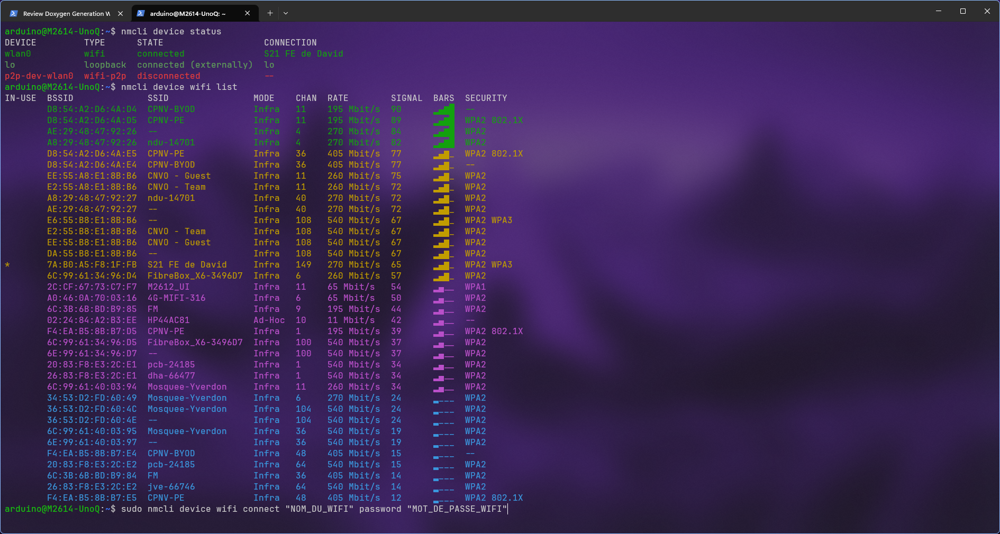

# Document de transmission - Robot M2614

Ce document est le guide de mise en route et de transmission haut niveau du robot **M2614 - La face cachée de la lune**. Il regroupe les informations essentielles pour utiliser, connecter, maintenir et recalibrer le robot sans devoir lire immédiatement toute la documentation technique.

La totalité du projet est open-source et disponible sur GitHub :

| Dépôt | Description |
| --- | --- |
| [M2614_LaFaceCacheeDeLaLune-Arduino](https://github.com/OPHELIE-MCT/M2614_LaFaceCacheeDeLaLune-Arduino) | Code de l'Arduino Uno Q |
| [M2614_LaFaceCacheeDeLaLune-Python](https://github.com/OPHELIE-MCT/M2614_LaFaceCacheeDeLaLune-Python) | Service Python du SBC Linux de la Uno Q |
| [ball-sorter](https://github.com/OPHELIE-MCT/ball-sorter) | Code du trieur de balles |
| [ball-analyzer](https://github.com/OPHELIE-MCT/ball-analyzer) | Code de l'analyseur de balles local |

---

## Vue d'ensemble du robot

Le robot est composé de trois sous-systèmes principaux.

- Une Arduino Uno Q
- Un petit ordinateur Linux embarqué ([SBC](https://fr.wikipedia.org/wiki/Ordinateur_monocarte), Single-Board Computer) intégré à l'Arduino Uno Q
- Un trieur de balles autonome piloté par une Seeeduino Nano

### Arduino Uno Q - partie microcontrôleur

La partie microcontrôleur de l'Arduino Uno Q exécute le firmware principal du robot. Elle gère les éléments temps réel :

- télécommande RC (radio commande) ;
- moteurs de la base mécanum ;
- encodeurs rotatif ;
- capteurs de navigation [ToF](https://fr.wikipedia.org/wiki/Temps_de_vol) (Time of Flight) et LiDAR ;
- modes manuel et automatique ;
- activation ou désactivation du trieur de balles via la sortie `ENABLE_SORTER` ;
- mode de calibration couleur lorsque le capteur AS7341 de calibration est détecté au démarrage.

Le fichier principal est :

```text
M2614_LaFaceCacheeDeLaLune.ino
```

### Arduino Uno Q - partie SBC Linux

L'Arduino Uno Q contient aussi un petit ordinateur Linux embarqué. Dans ce projet, il sert surtout à exécuter le service Python de calibration couleur.

Ce service fournit :

- une interface web ;
- la capture d'échantillons couleur ;
- le stockage des données en CSV ;
- l'analyse des centroïdes de couleur ;
- la génération de constantes C++ à recopier dans le firmware du trieur.

Le dépôt concerné est :

```text
M2614_LaFaceCacheeDeLaLune-Python
```

### Seeeduino Nano - trieur de balles

Le trieur est un sous-système séparé. Il est piloté par une carte Seeeduino Nano et fonctionne de manière autonome une fois activé.

Il gère :

- le moteur d'avance des balles ;
- le servo de déviation ;
- deux capteurs ToF locaux ;
- le capteur couleur AS7341 ;
- l'affichage NeoPixel ;
- la classification embarquée des couleurs.

Le firmware concerné est dans le dépôt :

```text
ball-sorter

```

---

## Principe général de fonctionnement

### Pourquoi le projet n'utilise pas Arduino App Lab comme solution principale

L'Arduino Uno Q est conçue pour fonctionner avec **Arduino App Lab**, qui permet de lancer des applications directement sur la partie Linux de la carte. Cependant, App Lab repose sur un modèle orienté applications et conteneurs.

Dans ce projet, ce choix n'a pas été retenu pour l'exploitation courante, principalement pour des raisons de performance :

- la carte dispose de ressources limitées, notamment environ 4 Go de RAM ;
- le MPU Qualcomm embarqué reste modeste pour des traitements continus ;
- les conteneurs Docker et l'interface App Lab consomment une part non négligeable des ressources ;
- le robot fonctionne en mode embarqué et généralement sans écran, clavier ou souris.

Le développement retenu est donc plus traditionnel :

- firmware Arduino compilé avec **Arduino CLI** ;
- compatibilité possible avec l'IDE Arduino classique ;
- service Python exécuté directement sur Linux ;
- service lancé via **systemd** ;
- pas d'application Docker App Lab pour la partie exploitation.

### Répartition des tâches

Les règles de conception à conserver sont les suivantes :

- le contrôle moteur et les boucles rapides restent côté microcontrôleur ;
- le SBC Linux gère les fichiers, l'interface web et les analyses non temps réel ;
- RouterBridge sert uniquement aux commandes et données lentes, pas au pilotage dynamique. La communication entre le [MCU](https://fr.wikipedia.org/wiki/Microcontr%C3%B4leur) (Microcontroller Unit) et le [MPU](https://en.wikipedia.org/wiki/Microprocessor) (Microprocessor Unit) est imposée à un baudrate de 9600 sans possibilité de le changer ;
- le trieur prend ses décisions localement une fois activé.

---

## Mise en route rapide du robot

### Avant d'allumer

Avant une utilisation normale, vérifier que :

1. le firmware principal est chargé sur l'Arduino Uno Q ;
2. le firmware `ball-sorter` est chargé sur la Seeeduino Nano ;
3. la télécommande RC est alimentée et appairée ;
4. le trieur est correctement alimenté ;
5. le capteur AS7341 de couleur  n'est pas branché au démarrage, sauf si l'objectif est de recalibrer les couleurs ;
6. la zone autour du robot est dégagée.

### Configuration de l'alimentation

Le robot possède une batterie PowerBank de 25000 mAh avec 140W en sortie et 60W en entrée pour la recharge. La batterie est branchée sur la carte d'alimentation du robot via un connecteur USB-C qui peut également servir pour la recharge du robot.



Sur l'arrière du robot, situé au niveau de l'aimant, se situe la carte d'alimentation générale. Elle sert de négociateur de puissance entre la batterie afin de sortir du 32V 3A. Si la LED verte est allumée, la batterie est correctement alimentée. Si la LED est rouge et clignotte, le niveau de batterie est inférieur à 10% et ne sors plus que 60W. Il est recommandé de recharger la batterie avant de continuer. On peux observer le niveau de batterie sur la batterie elle-même en regardant à travers la plaque transparante de PMMA du dessous du châssis.

L'interrupteur général du robot est situé sur le bloc rouge tout au dessus fixé sur le système de tri. Ce bloc comprend également un interrupteur d'arrêt d'urgence ainsi qu'une LED d'alimentation générale. L'arrêt d'urgence coupe l'alimentation de la puissance du robot et envoie une indication au microcontrôleur du système de tri afin qu'il s'arrête également. La LED d'alimentation générale est allumée lorsque l'interrupteur général est activé.

Sur les côtés droit et gauche du robot, se trouvent deux alimentations de laboratoire portables permettant d'alimenter la commande et la puissance du robot. Ces alimentations doivent être réglées sur 12V, et un maximum de 3A pour la commande, et 6A pour la puissance. Ce qu'on entends par "puissance" est l'alimentation des 4 moteurs du châssis sur lesquelles sont montées les roues mecanum. L'alimentation de commande est située sur le flanc droit, sous l'Arduino Uno Q, et l'alimentation de puissance est située sur le flanc gauche, à proximité du moteur de tri. Ces alimentations sont préconfigurées pour démmarer dès que l'interrupteur général est activé, mais il est possible de les allumer et de les éteindre manuellement si nécessaire.

Le manuel d'utilisation des alimentations de laboratoire portables est disponible sur le site du fournisseur : [(RK6006-2024-4-23.pdf)](https://download.bastelgarage.ch/Produkte/RK6006-2024-4-23.pdf).

### Démarrage normal

1. Allumer la télécommande RC.
2. Alimenter le robot.
3. Attendre la fin du démarrage de l'Arduino Uno Q.
4. Vérifier que le robot répond correctement aux commandes manuelles.
5. Vérifier le fonctionnement du trieur en mode manuel si nécessaire.

Si le capteur AS7341 de couleur est branché pendant le démarrage, le robot entre en mode calibration au lieu du mode de conduite normal.

### Modes de conduite

Le robot possède trois états principaux :

- **mode manuel** : pilotage à la télécommande ;
- **mode automatique** : navigation autonome selon la machine d'état du firmware ;
- **connexion perdue** : le robot s'arrête.

#### Contrôles en mode manuel

La télécommande utilise deux joysticks et leurs boutons poussoirs :

- **Joystick gauche** : déplacement dans le plan (avant/arrière + gauche/droite).
- **Joystick droit, axe latéral uniquement** : rotation sur soi-même (gauche/droite). L'axe longitudinal du joystick droit n'est pas utilisé.
- **Bouton du joystick droit** (appui puis relâche) : bascule l'état du trieur de balles (activation/désactivation).
- **Les deux boutons de joystick enfoncés ensemble** : activation manuelle du mode autonome.

La bascule du trieur se fait sur flanc descendant du bouton : appuyer puis relâcher le bouton du joystick droit inverse l'état du trieur. Le trieur est automatiquement désactivé tant que les deux boutons de joystick sont enfoncés ensemble ou pendant le mode automatique.

Le passage en mode automatique se fait par la combinaison des deux boutons de joystick.

---

## Activer ou désactiver le mode autonome

Le comportement autonome peut être activé ou désactivé à l'exécution sans recompilation depuis l'interface web. C'est utile quand le robot doit être utilisé dans un autre contexte ou sur un autre circuit.

### Bascule via l'interface web

L'interface de calibration expose un interrupteur « Autonomous mode » dans la section « Robot control ».

Avec la bascule **activée**, si le signal RC de conduite est perdu pendant suffisamment longtemps, le robot peut passer en contrôle automatique selon la logique prévue dans le firmware.

Avec la bascule **désactivée**, si le signal RC est perdu, le robot passe en état de connexion perdue et s'arrête au lieu de lancer le comportement autonome.

Veuillez noter que la télécommande doit être allumée afin que ce paramètre prenne effet immédiatement. La logique d'activation du mode autonome s'effectue à la mise à jour du signal de la télécommande.

### Valeur par défaut au démarrage

L'état par défaut au démarrage du MCU est défini dans `M2614_LaFaceCacheeDeLaLune.ino` :

```cpp
bool autonomousModeEnabled = false;
```

Pour changer la valeur par défaut, modifier cette variable puis recompiler et téléverser le firmware. La bascule runtime prévaut ensuite tant que le MCU n'est pas redémarré.

---

## Obtenir un shell sur l'Arduino Uno Q

Avant de configurer le réseau en ligne de commande, il faut d'abord accéder à un shell Linux sur la carte.

Deux approches sont disponibles :

1. passer par **ADB installé sur le PC** ;
2. passer par **Arduino App Lab**, qui intègre aussi un accès shell basé sur ADB.

### Méthode A - Connexion avec ADB installé sur le PC

Cette section est une adaptation en français du tutoriel officiel Arduino **Connect to UNO Q via ADB** :

```text
https://docs.arduino.cc/tutorials/uno-q/adb/
```

La documentation Arduino est publiée sous licence Creative Commons Attribution-ShareAlike 4.0. Les étapes ci-dessous reprennent le contenu utile pour ce projet sous forme traduite et adaptée.

#### Matériel nécessaire

- Arduino Uno Q ;
- câble USB-C capable de transférer des données ;
- ordinateur Windows, macOS ou Linux.

#### Installer ADB sur l'ordinateur

ADB signifie **[Android Debug Bridge](https://en.wikipedia.org/wiki/Android_Debug_Bridge)**. C'est l'outil qui permet d'ouvrir un shell sur la partie Linux de l'Arduino Uno Q via USB.

##### Windows

Ouvrir PowerShell ou Windows Terminal, puis exécuter :

```powershell
winget install Google.PlatformTools
```

Vérifier l'installation :

```powershell
adb version
```

Si `adb` n'est pas reconnu, redémarrer le terminal ou vérifier que les Platform Tools sont bien dans le `PATH`.

##### macOS

Avec Homebrew :

```bash
brew install android-platform-tools
```

Vérifier :

```bash
adb version
```

##### Linux Debian / Ubuntu

```bash
sudo apt-get update
sudo apt-get install android-sdk-platform-tools
```

Vérifier :

```bash
adb version
```

#### Se connecter à l'Arduino Uno Q avec ADB

1. Brancher l'Arduino Uno Q au PC avec le câble USB-C.
2. Attendre jusqu'à une minute que la carte soit détectée.
3. Lister les appareils ADB :

```bash
adb devices
```

Une ligne correspondant à la carte doit apparaître.

1. Ouvrir un shell sur la carte :

```bash
adb shell
```

1. Si un mot de passe est demandé par la carte non initialisée, utiliser le mot de passe par défaut indiqué par Arduino :

```text
arduino
```

Dans le cadre de ce projet, les identifiants SSH configurés sont précisés plus bas.

1. Une fois dans le shell, les commandes sont exécutées directement sur l'Arduino Uno Q.

Pour sortir du shell :

```bash
exit

```

---

### Méthode B - Connexion avec Arduino App Lab

Arduino App Lab peut être utilisé uniquement comme outil d'accès à la carte, même si le projet ne s'appuie pas sur App Lab pour l'exploitation permanente.

#### Connexion avec l'interface App Lab

1. Lancer Arduino App Lab sur l'ordinateur.
2. Brancher l'Arduino Uno Q en USB-C.
3. Sélectionner la carte lorsqu'elle apparaît dans App Lab.
4. Selon l'état de la carte, App Lab peut proposer directement une configuration WiFi.
5. Suivre l'assistant si la configuration WiFi graphique est proposée.

#### Connexion avec le terminal intégré App Lab

Si App Lab ne propose pas directement la configuration WiFi, il est possible d'utiliser son accès shell.

1. Lancer App Lab.
2. Brancher et sélectionner l'Arduino Uno Q.
3. Cliquer sur le petit logo de terminal en bas à gauche.
4. Ouvrir un shell sur la carte.
5. Utiliser ensuite les commandes `nmcli` décrites dans le chapitre « Connexion réseau de l'Arduino Uno Q ».

Ce shell utilise une technologie ADB intégrée à Arduino App Lab. Les commandes réseau sont donc les mêmes que via ADB installé manuellement.

---

## Connexion réseau de l'Arduino Uno Q

L'Arduino Uno Q est actuellement configurée pour un partage de connexion spécifique. Si le réseau change, il faut reconnecter la carte au nouveau WiFi.

La connexion peut se faire soit avec l'assistant graphique d'App Lab, soit via un shell déjà obtenu avec les méthodes du chapitre précédent.

### Important : WiFi de l'école

Le WiFi de l'école ne doit pas être considéré comme utilisable pour cette carte dans ce projet.

Raisons :

- il nécessite une authentification spécifique ;
- même après authentification, le pare-feu interne bloque les connexions SSH et web entre appareils ;
- l'interface web de calibration et les connexions SSH ne sont donc pas fiables sur ce réseau.

Il est préférable d'utiliser :

- un partage de connexion mobile ;
- un routeur local dédié ;
- un réseau WiFi simple dont on contrôle les paramètres.

### Option 1 - Configuration via Arduino App Lab

Si Arduino App Lab propose l'assistant WiFi graphique après connexion de la carte, vous pouvez l'utiliser directement sans passer par `nmcli`.

### Option 2 - Configuration via shell avec `nmcli`

`nmcli` est l'outil en ligne de commande de NetworkManager. Il permet de lister les réseaux, se connecter à un WiFi, vérifier l'adresse IP et supprimer une ancienne configuration.

Les commandes ci-dessous doivent être exécutées **dans le shell de l'Arduino Uno Q**, obtenu via ADB ou via le terminal App Lab.



#### Vérifier les interfaces réseau

```bash
nmcli device status
```

Repérer l'interface WiFi. Elle est généralement nommée `wlan0`, mais le nom exact peut varier.

#### Lister les réseaux disponibles

```bash
nmcli device wifi list
```

Si le réseau attendu n'apparaît pas, relancer un scan :

```bash
nmcli device wifi rescan
nmcli device wifi list
```

#### Se connecter à un réseau WiFi simple

Remplacer `NOM_DU_WIFI` et `MOT_DE_PASSE_WIFI` par les valeurs réelles :

```bash
sudo nmcli device wifi connect "NOM_DU_WIFI" password "MOT_DE_PASSE_WIFI"
```

Exemple :

```bash
sudo nmcli device wifi connect "MonPartage" password "motdepasse123"
```

#### Se connecter à un réseau caché

```bash
sudo nmcli device wifi connect "NOM_DU_WIFI" password "MOT_DE_PASSE_WIFI" hidden yes
```

#### Vérifier la connexion

```bash
nmcli connection show --active
ip addr show
```

Pour afficher rapidement l'adresse IP :

```bash
hostname -I
```

Noter cette adresse IP : elle servira pour SSH, l'interface web ou le téléversement réseau.

#### Oublier une ancienne connexion WiFi

Lister les connexions enregistrées :

```bash
nmcli connection show
```

Supprimer une connexion inutile :

```bash
sudo nmcli connection delete "NOM_DE_LA_CONNEXION"
```

#### Redémarrer le réseau en cas de problème

```bash
sudo systemctl restart NetworkManager
```

Puis vérifier :

```bash
nmcli device status
nmcli connection show --active
```

---

## Accès SSH à l'Arduino Uno Q

Une fois l'Arduino Uno Q connectée au WiFi, il est possible de s'y connecter en SSH.

Identifiants du projet :

```text
Utilisateur : arduino
Mot de passe : M2614
```

Connexion :

```bash
ssh arduino@ADRESSE_IP_DE_LA_CARTE
```

Exemple :

```bash
ssh arduino@192.168.1.42
```

Le mot de passe demandé est :

```text
M2614
```

### Utiliser une clé SSH

L'Arduino Uno Q supporte l'authentification par clé SSH. C'est recommandé pour éviter de retaper le mot de passe.

#### Étape 1 - Générer une clé sur le PC

Sur le PC de maintenance, ouvrir un terminal PowerShell et exécuter :

```bash
ssh-keygen
```

Accepter le chemin proposé par défaut, par exemple :

```text
C:\Users\<NomUtilisateur>/.ssh/id_ed25519
```

Une passphrase est optionnelle. Pour un poste partagé, il est préférable d'en utiliser une.

#### Étape 2 - Copier la clé vers l'Arduino Uno Q

Méthode simple avec `ssh-copy-id` si disponible :

```bash
ssh-copy-id arduino@ADRESSE_IP_DE_LA_CARTE
```

Entrer le mot de passe `M2614` lorsque demandé.

#### Étape 3 - Méthode manuelle si ssh-copy-id n'est pas disponible

Afficher la clé publique sur le PC :

```bash
cat $env:USERPROFILE\.ssh\id_ed25519.pub
```

Se connecter à l'Arduino :

```bash
ssh arduino@ADRESSE_IP_DE_LA_CARTE
```

Créer le dossier SSH :

```bash
mkdir -p ~/.ssh
chmod 700 ~/.ssh
```

Ajouter la clé publique dans `authorized_keys` :

```bash
nano ~/.ssh/authorized_keys
```

Coller la ligne complète de la clé publique, sauvegarder, puis appliquer les permissions :

```bash
chmod 600 ~/.ssh/authorized_keys
```

Tester depuis le PC :

```bash
ssh arduino@ADRESSE_IP_DE_LA_CARTE
```

La connexion doit fonctionner sans demander le mot de passe, ou uniquement demander la passphrase locale de la clé si une passphrase a été configurée.

---

## Interface graphique Linux de l'Uno Q

Pour économiser les ressources, l'interface graphique de la partie Linux a été désactivée. La carte est utilisée en permanence en mode **headless**, c'est-à-dire sans écran local.

Cela évite au serveur graphique de consommer inutilement du CPU et de la RAM.

### Réactiver temporairement l'interface graphique

Cette commande démarre la cible graphique pour la session courante, sans changer le démarrage par défaut :

```bash
sudo systemctl isolate graphical.target
```

### Réactiver l'interface graphique au démarrage

Pour démarrer automatiquement sur l'interface graphique à chaque boot :

```bash
sudo systemctl set-default graphical.target
sudo reboot
```

### Revenir au mode headless / TTY

Pour revenir au comportement optimisé du projet :

```bash
sudo systemctl set-default multi-user.target
sudo reboot
```

Pour basculer temporairement vers le mode TTY sans changer le prochain démarrage :

```bash
sudo systemctl isolate multi-user.target
```

---

## Service Python de calibration sur le SBC

Le service Python s'exécute directement sur le Linux embarqué, sans conteneur Docker App Lab.

La configuration de référence est :

```text
Utilisateur : arduino
Répertoire : /home/arduino/app
Commande   : /home/arduino/.local/bin/uv run main.py
Service    : M2614.service
```

Cet à dire que le dépôt `M2614_LaFaceCacheeDeLaLune-Python` est cloné dans `/home/arduino/app` et que le service systemd `M2614.service` copié et installé dans `/etc/systemd/system/`.

### Vérifier l'état du service

```bash
systemctl status M2614.service
```

### Démarrer le service

```bash
systemctl start M2614.service
```

### Arrêter le service

```bash
systemctl stop M2614.service
```

### Redémarrer le service

```bash
sudo systemctl restart M2614.service
```

### Activer le service au démarrage (par défaut, recommandé)

```bash
sudo systemctl enable M2614.service
```

### Désactiver le service au démarrage

```bash
sudo systemctl disable M2614.service
```

### Voir les logs

```bash
journalctl -u M2614.service -f
```

### Accéder à l'interface web

Depuis un ordinateur sur le même réseau :

```text
http://ADRESSE_IP_DE_LA_CARTE:8000/
```

L'interface permet notamment :

- de choisir une couleur ;
- de démarrer ou arrêter une capture ;
- de réinitialiser le CSV ;
- de télécharger les mesures ;
- de lancer l'analyse des centroïdes ;
- de redémarrer le microcontrôleur.

---

## Calibration couleur

La calibration couleur sert à mettre à jour les constantes utilisées par le trieur de balles.

### Quand recalibrer

Recalibrer si :

- l'éclairage change fortement ;
- le capteur AS7341 ou sa position change ;
- les balles changent ;
- le tri devient instable ;
- les couleurs détectées ne correspondent plus aux balles réelles.

### Préparation matérielle calibration (Qwiic)

Avant la calibration, préparer le câblage pour que le capteur couleur soit visible par l'Uno Q au reset :

1. Débrancher le câble Qwiic venant du PCB de tri.
2. Débrancher le capteur de proximité du port Qwiic de l'Uno Q.
3. Brancher la chaîne Qwiic des capteurs du système de tri sur le port Qwiic de l'Uno Q.

### Procédure générale

1. Vérifier que le service Python est lancé sur le SBC.
2. Ouvrir l'interface web du service : `http://ADRESSE_IP_DE_LA_CARTE:8000/`.
3. Cliquer sur la commande de reset CSV dans l'interface.
4. Cliquer sur la commande `reset arduino` dans l'interface.
5. Attendre que le MCU redémarre et entre en mode calibration (pas besoin de redémarrage complet de la carte).
6. Choisir une couleur dans l'interface.
7. Démarrer la capture.
8. Présenter les balles correspondantes.
9. Attendre environ `100` échantillons ou arrêter manuellement.
10. Répéter pour les couleurs nécessaires.
11. Lancer l'analyse depuis l'interface.
12. Copier le bloc généré dans `ball-sorter/config.h` (fichier dédié, remplaçable en copier-coller).
13. Recompiler et téléverser le firmware `ball-sorter` sur la Seeeduino Nano.
14. Tester le tri avec un jeu de balles réel.

### Retour au mode normal après calibration

Pour revenir au mode roulage normal, refaire les connexions dans l'ordre inverse :

1. Débrancher la chaîne Qwiic des capteurs de tri du port Qwiic de l'Uno Q.
2. Rebrancher le capteur de proximité sur le port Qwiic de l'Uno Q.
3. Rebrancher le câble Qwiic vers le PCB de tri.
4. Cliquer de nouveau sur `reset arduino` dans l'interface web.
5. Vérifier que le MCU redémarre en mode normal (et non en mode calibration).

### Rôle du notebook ball-analyzer

Le dépôt `ball-analyzer` reste disponible comme outil de secours ou d'analyse hors ligne. Le workflow nominal recommandé est toutefois l'interface web du service Python sur l'Uno Q.

---

## Trieur de balles

Le trieur fonctionne localement sur la Seeeduino Nano. Le firmware principal du robot ne lui envoie pas de commandes complexes : il active ou désactive seulement le trieur via une broche dédiée.

### Comportement attendu

1. Une balle arrive dans le mécanisme.
2. Un capteur ToF détecte sa présence.
3. Le moteur avance la balle jusqu'à la zone de lecture.
4. Le capteur AS7341 mesure la couleur.
5. Le classifieur embarqué compare la mesure aux centroïdes.
6. Le servo oriente la balle vers la sortie adaptée.
7. Les NeoPixels affichent la couleur détectée et un niveau de confiance.

### Retours visuels

- couleur affichée : couleur prédite ;
- plus de pixels allumés : confiance plus élevée ;
- animation rouge : arrêt d'urgence ou erreur critique ;
- animation magenta : erreur capteur au démarrage.

---

## Compilation et téléversement

### Firmware principal Uno Q

Carte cible :

```text
arduino:zephyr:unoq
```

Compilation avec Arduino CLI :

```powershell
arduino-cli compile -b arduino:zephyr:unoq --build-path .build
```

Téléversement USB, exemple avec un port à adapter :

```powershell
arduino-cli upload -p COM9 -b arduino:zephyr:unoq --input-dir .build
```

`COM9` est un exemple issu de la configuration de développement. Le port réel peut changer.

### Firmware du trieur

Carte cible :

```text
Seeeduino:avr:nano
```

Compilation :

```powershell
arduino-cli compile -b Seeeduino:avr:nano --build-path $env:TEMP\arduino-build
```

Téléversement, exemple avec un port à adapter :

```powershell
arduino-cli upload --verbose -p COM28 -b Seeeduino:avr:nano --input-dir $env:TEMP\arduino-build
```

`COM28` est un exemple. Vérifier le port série réel avant le téléversement.

---

## Dépannage rapide

### Le robot ne répond pas à la télécommande

Vérifier :

- que la télécommande est allumée ;
- que le récepteur RC est alimenté ;
- que les canaux A à D sont valides ;
- que le robot n'est pas en mode calibration ;
- que le signal RC n'a pas été perdu.

### Le robot démarre en mode calibration

Cause probable : le capteur AS7341 de couleur est détecté au démarrage.

Solution :

1. éteindre le robot ;
2. débrancher le capteur de couleur pour le rebrancher sur le PCB de tri si l'on veut utiliser le robot normalement ;
3. redémarrer.

### Le mode automatique s'active pas alors que le signal RC est perdu

Allumer la télécommande, puis activer la bascule autonome depuis l'interface web (section « Robot control »).

Pour changer la valeur par défaut au démarrage, modifier dans `M2614_LaFaceCacheeDeLaLune.ino` :

```cpp
bool autonomousModeEnabled = false;
```

et mettre la valeur à `true`, puis recompiler et téléverser.

### Impossible d'accéder à l'interface web

Vérifier :

- que l'Uno Q est bien connectée au WiFi ;
- que le PC est sur le même réseau ;
- que le réseau ne bloque pas les connexions inter-appareils ;
- que le service `M2614.service` est actif ;
- que l'adresse utilisée est correcte.

Commandes utiles sur l'Uno Q :

```bash
hostname -I
systemctl status M2614.service
journalctl -u M2614.service -n 50
```

### Le trieur ne bouge pas

Vérifier :

- l'alimentation du moteur et du servo ;
- le firmware `ball-sorter` ;
- l'entrée d'arrêt d'urgence ;
- la ligne `ENABLE_SORTER` ;
- le comportement du bouton du joystick droit en mode manuel (appui puis relâche pour basculer le trieur).

### Les balles sont mal triées

Vérifier :

- la qualité de l'éclairage ;
- la propreté du capteur AS7341 de couleur ;
- les retours NeoPixel ;
- la présence des derniers centroïdes dans `ball-sorter/config.h` ;
- la nécessité de refaire une calibration.

---

## Résumé opérationnel

Pour utiliser le robot normalement :

1. s'assurer que le capteur AS7341 de couleur n'est pas branché au démarrage ;
2. allumer la télécommande ;
3. alimenter le robot ;
4. tester le mode manuel ;
5. activer le trieur si nécessaire ;
6. utiliser le mode automatique uniquement si le contexte s'y prête.

Pour changer le réseau WiFi :

1. brancher l'Uno Q au PC ;
2. ouvrir un shell via ADB ou App Lab ;
3. utiliser `nmcli` pour connecter la carte ;
4. noter l'adresse IP ;
5. vérifier SSH et l'interface web.

Pour désactiver le mode autonome :

1. utiliser l'interrupteur « Autonomous mode » de l'interface web, ou appeler `POST /api/robot/autonomous` avec `{"enabled": false}` ;
2. pour changer la valeur par défaut au démarrage, modifier `autonomousModeEnabled` dans `M2614_LaFaceCacheeDeLaLune.ino`, puis recompiler et téléverser.

Pour recalibrer les couleurs :

1. brancher le capteur AS7341 de couleur ;
2. redémarrer l'Uno Q ;
3. ouvrir l'interface web ;
4. capturer les échantillons ;
5. lancer l'analyse ;
6. recopier les constantes dans `ball-sorter` ;
7. recompiler et tester le trieur.

---

## Bilan de fin de projet

### État des lieux du projet

- Fonctionnel.
- Terminé.
- Conforme au cahier des charges.

### Ce qu'il manque

- Rien.

### Améliorations possibles

- Ajouter un mode totalement autonome.
- Améliorer la communication bidirectionnelle entre les microcontrôleurs.
- Remplacer les arbres moteur de diamètre 4 par du 6 ou 8.
- Utiliser des roues de meilleure qualité.
- Ré-usiner les deux plaques de PMMA :
  - déplacer les trous des alimentations sur la plaque du dessous ;
  - corriger la plaque basse du système de tri, découpée dans l'ordre inverse (trous et contours inversés).
- Prévoir un meilleur système de guide-câbles.
- Prévoir un moyen d'atténuer les changements de luminosité ambiante sur le capteur couleur.

### Ce qui aurait dû être fait différemment

- Intégrer le système de tri plus tôt dans la conception générale, pour éviter de devoir loger tardivement un sous-système volumineux sur le châssis.
- Réaliser un châssis prototype moins spécifique au départ (commencer large, puis réduire la taille ensuite).

### Trois points à conserver

- La complémentarité des compétences entre les membres du binôme.
- Les roues mecanum pour le pilotage omnidirectionnel.
- Une conception « futureproof » et évolutive (présence de nombreux points de fixation pour des modules non prévus initialement).
